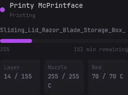

# Bambuddy Printer Status

Displays live status for one printer monitored by
[Bambuddy](https://github.com/maziggy/bambuddy), including the active print,
progress, remaining time, layer count, and nozzle and bed temperatures.

## Preview



## Configuration

```yaml
- type: dynawidgets
  widget: bambuddy-printer-status
  title: Bambuddy Printer Status
  cache: 30s
  url: ${BAMBUDDY_URL}/api/v1/printers/${BAMBUDDY_PRINTER_ID}/status
  headers:
    X-API-Key: ${BAMBUDDY_READONLY}
```

## Environment variables

| Variable | Required | Description |
| --- | --- | --- |
| `BAMBUDDY_URL` | Yes | Base URL of the Bambuddy server, without a trailing slash. |
| `BAMBUDDY_PRINTER_ID` | Yes | Numeric ID of the printer to display. |
| `BAMBUDDY_READONLY` | Yes | Bambuddy API key with read-status access. |

The widget only performs a cached GET request to Bambuddy's printer-status
endpoint. It does not need printer-control access.
