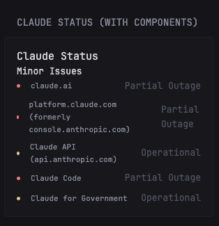
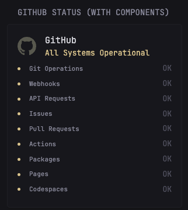
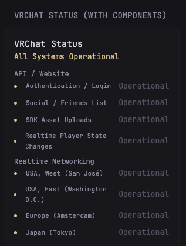

# Custom Glance Widgets

This directory contains custom widget YAML files organized by widget. Each widget directory contains the YAML configuration and optional documentation and screenshots.

## Table of Contents

- [How to Use These Widgets](#how-to-use-these-widgets)
- [Bambu Labs Status](#bambu-labs-status)
- [Claude Status](#claude-status)
- [GitHub Status](#github-status)
- [VRChat Status](#vrchat-status)
- [Customization](#customization)
- [Reference](#reference)

## How to Use These Widgets

### Method 1: Include in Your Configuration

To use these custom widgets in your Glance dashboard, use the `$include` directive in your Glance configuration YAML files:

```yaml
- type: group
  widgets:
    - $include: widgets/claude-status/claude-status.yml
    - $include: widgets/github-status/github-status.yml
    - $include: widgets/vrchat-status/vrchat-status.yml
    - $include: widgets/bambu-labs-status/bambu-labs-status.yml
```

### Method 2: Copy to Your Config Directory

Alternatively, copy the desired widget subdirectories to your Glance `widgets` configuration directory and reference them in your page configurations.

## Widget Directory Details

### Bambu Labs Status

Displays real-time status of Bambu Lab services and components with color-coded indicators.

**Configuration:**
```yaml
- $include: widgets/bambu-labs-status/bambu-labs-status.yml
```

**Requirements:**
- Internet access to `status.bambulab.com`
- Optional: Customize cache duration (default: 5m)

**Features:**
- Overall service status indicator
- Component status breakdown with color-coded status indicators
- Real-time updates every 5 minutes

**Screenshots:**


---

### Claude Status

Shows Claude service status with component grouping and status breakdown.

**Configuration:**
```yaml
- $include: widgets/claude-status/claude-status.yml
```

**Requirements:**
- Internet access to `status.claude.com`
- Optional: Customize cache duration (default: 2m)

**Features:**
- Overall system status with operational/minor/major/critical indicators
- Grouped and ungrouped component display
- Component status breakdown (Operational, Degraded, Partial Outage, Major Outage, Maintenance)
- Real-time updates every 2 minutes
- Services monitored:
  - claude.ai
  - platform.claude.com (formerly console.anthropic.com)
  - Claude API (api.anthropic.com)
  - Claude Code
  - Claude for Government

**Screenshots:**



---

### GitHub Status

Shows GitHub platform status with a breakdown of individual service components.

**Configuration:**
```yaml
- $include: widgets/github-status/github-status.yml
```

**Requirements:**
- Internet access to `www.githubstatus.com`
- Optional: Customize cache duration (default: 5m)

**Features:**
- Overall GitHub status indicator
- Individual component status with color-coded indicators
- Service component breakdown
- Real-time updates every 5 minutes

**Screenshots:**



---

### VRChat Status

Monitors VRChat service status with component grouping and status breakdown.

**Configuration:**
```yaml
- $include: widgets/vrchat-status/vrchat-status.yml
```

**Requirements:**
- Internet access to `status.vrchat.com`
- Optional: Customize cache duration (default: 2m)

**Features:**
- Overall VRChat service status
- Grouped components with hierarchical display
- Individual component status with color-coded indicators
- Supports maintenance status tracking
- Real-time updates every 2 minutes

**Screenshots:**



---

## Environment Variables

These widgets use the standard Glance custom-api widget type and don't require any environment variables. However, ensure your Glance instance has internet access to fetch the status data from the respective APIs.

## Customization

To customize any widget (e.g., change cache duration or title), copy the YAML content directly into your configuration and modify the `cache`, `title`, or `template` properties as needed.

Example: Adjusting cache duration
```yaml
- type: custom-api
  title: Claude Status (With Components)
  cache: 5m  # Change from 2m to 5m
  url: https://status.claude.com/api/v2/summary.json
  template: |
    # ... template content ...
```

## Status Indicators

All widgets use a consistent color scheme:
- **Green (Positive)**: All Systems Operational
- **Yellow (Highlight)**: Minor Issues / Degraded Performance
- **Red (Negative)**: Major Outage / Partial Outage / Critical Issues
- **Gray (Muted)**: Under Maintenance / Offline

## Reference

- [Glance Documentation](https://github.com/glanceapp/glance)
- [Glance Widget Types](https://github.com/glanceapp/glance/blob/main/docs)
- [Custom API Widget](https://github.com/glanceapp/glance#custom-api-widget)
- [Statuspage API](https://developer.statuspage.io/)
