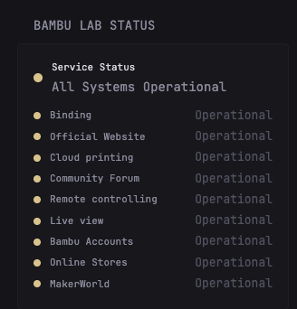

# Bambu Labs Status Widget

Displays real-time status of Bambu Lab services and components with color-coded indicators.

## Configuration

```yaml
- $include: widgets/bambu-labs-status/bambu-labs-status.yml
```

## Features

- Overall service status indicator
- Component status breakdown with color-coded status indicators
- Real-time updates every 5 minutes
- Internet access to `status.bambulab.com`

## Screenshot



## Customization

To customize the cache duration or title:

```yaml
- type: custom-api
  title: Bambu Lab Status
  cache: 10m  # Change duration as needed
  url: https://status.bambulab.com/api/v2/summary.json
  template: |
    # ... template content ...
```
